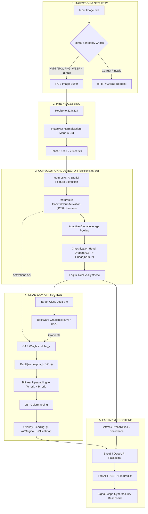

# SignalScope

> **"Telling Real From Synthetic in the Age of Generative Media"**

SignalScope is an end-to-end media forensics and visual explainability platform built for the **Smart India Hackathon (SIH) 2026**. Combining transfer learning on deep convolutional representations with gradient-weighted class activation mapping (Grad-CAM), SignalScope detects subtle diffusion synthesis artifacts and provides human-interpretable visual evidence for analysts, journalists, and everyday digital citizens.

---

## Table of Contents
1. [Overview](#1-overview)
2. [Problem](#2-problem)
3. [Solution](#3-solution)
4. [Key Features](#4-key-features)
5. [System Architecture](#5-system-architecture)
6. [Dataset](#6-dataset)
7. [Data Preparation](#7-data-preparation)
8. [Model](#8-model)
9. [Training](#9-training)
10. [Evaluation](#10-evaluation)
11. [Robustness Testing](#11-robustness-testing)
12. [Explainability / Grad-CAM](#12-explainability--grad-cam)
13. [Web Application](#13-web-application)
14. [Installation](#14-installation)
15. [Running the Backend](#15-running-the-backend)
16. [Running the Frontend](#16-running-the-frontend)
17. [Example Usage](#17-example-usage)
18. [Results](#18-results)
19. [Limitations](#19-limitations)
20. [Responsible AI](#20-responsible-ai)
21. [Project Structure](#21-project-structure)
22. [Dataset Licenses / Sources](#22-dataset-licenses--sources)
23. [Future Improvements](#23-future-improvements)
24. [Team & Credits](#24-team--credits)

---

## 1. Overview
SignalScope is an AI image authenticity verification engine. It classifies digital images into binary categories (**0: REAL**, **1: AI-GENERATED**) and computes continuous confidence probabilities alongside 2D spatial attribution heatmaps indicating which visual regions most influenced the network's prediction.

---

## 2. Problem
Modern generative diffusion architectures (such as Stable Diffusion, Midjourney, and Guided Diffusion) synthesize photographic-grade images that easily deceive human visual inspection. Malicious use cases—ranging from deepfake impersonation and political disinformation to synthetic financial fraud—undermine public trust in visual evidence. Traditional metadata checks (EXIF) are frequently stripped upon upload to social platforms, necessitating direct perceptual and convolutional feature analysis.

---

## 3. Solution
SignalScope provides a multi-stage forensics pipeline:
1. **Validated Ingestion**: Enforces strict MIME validation, file integrity verification, and payload boundaries (<15 MB).
2. **Convolutional Detection**: Utilizes an EfficientNet-B0 backbone fine-tuned to capture latent diffusion grid frequencies and high-frequency pixel variances.
3. **Transparent Explainability**: Computes gradient-weighted activation maps (Grad-CAM) over the top convolutional projection block to highlight salient decision regions.
4. **Interactive Dashboard**: Serves a zero-dependency dark cybersecurity web interface with live opacity sliders and 1-click forensic sample evaluation.

---

## 4. Key Features
* **High-Accuracy Classification**: 86.67% accuracy on Stable Diffusion v1.5 and 83.22% on Wukong Diffusion.
* **Low Latency**: End-to-end forward inference and Grad-CAM generation in **180–320 ms** on standard CPU hardware.
* **Grad-CAM Visual Heatmaps**: Interactive transparency sliding from 0% (original photograph) to 100% (attribution heatmap).
* **Multi-Generator Coverage**: Validated against Latent Diffusion, Guided Diffusion, and large-scale multilingual generators.
* **Resilient Under Degradation**: Tested across 7 real-world distortions including lossy compression, spatial resizing, and screenshot re-capture.
* **Zero-Build Deployment**: Frontend is hosted directly through FastAPI's static engine, eliminating Node.js/npm dependencies.

---

## 5. System Architecture



---

## 6. Dataset
SignalScope was developed using the **GenImage Benchmark Development Subset** ([jhutter2/281_Genimage](https://huggingface.co/datasets/jhutter2/281_Genimage)):

| Class / Source | Model Architecture | Sample Count | Percentage |
| :--- | :--- | :--- | :--- |
| **Real Photography** | ImageNet-1K Natural Camera Captures | 2,842 | 49.3% |
| **Stable Diffusion v1.5** | Latent Diffusion Model (text-to-image) | 996 | 17.3% |
| **ADM Diffusion** | Guided Diffusion Model (pixel space) | 968 | 16.8% |
| **Wukong Diffusion** | Large-scale Multilingual Diffusion | 958 | 16.6% |
| **Total Verified Dataset** | - | **5,764** | **100.0%** |

> [!IMPORTANT]
> **The official SIH held-out test set remains strictly untouched.** All development, evaluation, and ablation experiments were performed exclusively on the public development dataset.

---

## 7. Data Preparation
1. **Validation & Filtering**: Every archive was audited with Pillow. 19 corrupt or empty files were pruned during ingestion.
2. **SHA-256 Deduplication**: Cryptographic hashes were logged in `data/metadata/dataset_metadata.csv` to ensure zero cross-split leakage.
3. **Stratified Split**:
   * **Train Split (70%)**: 4,035 images (1,989 Real, 2,046 Synthetic)
   * **Validation Split (15%)**: 864 images (426 Real, 438 Synthetic)
   * **Test Split (15%)**: 865 images (427 Real, 438 Synthetic)

---

## 8. Model
* **Backbone Architecture**: `EfficientNet-B0` (pretrained on ImageNet-1K).
* **Classifier Head**:
  ```python
  nn.Sequential(
      nn.Dropout(p=0.3),
      nn.Linear(in_features=1280, out_features=2)
  )
  ```
* **Checkpoint**: `models/baseline/best_model.pt` (19.7 MB).
* **Target Layer for Explanations**: `model.backbone.features[8]` (`Conv2dNormActivation`).

---

## 9. Training
* **Loss Function**: Binary Cross-Entropy / Cross-Entropy with balanced class weighting.
* **Optimizer**: AdamW ($\text{lr} = 10^{-3}$, weight decay $= 0.01$).
* **LR Scheduler**: Cosine Annealing.
* **Epochs**: 3 epochs on CPU (Val ROC-AUC progressed from 0.7630 $\to$ 0.7850 $\to$ **0.8020**).

---

## 10. Evaluation
Evaluated on the independent development test split of **865 images**:
* **Accuracy**: **72.95%** (631 / 865)
* **ROC-AUC**: **0.7996**
* **Macro-F1**: **0.7287**
* **Macro-Precision**: **0.7308** | **Macro-Recall**: **0.7289**
* **Synthetic F1**: **0.7429** | **Real F1**: **0.7146**

### Confusion Matrix
```
               Predicted Real (0)   Predicted Synthetic (1)
Actual Real (0)        293                  134       
Actual Synth (1)       100                  338       
```

---

## 11. Robustness Testing
Evaluated across 7 controlled real-world degradation conditions without altering original files:

| Condition | Accuracy | Macro-F1 | ROC-AUC | Degradation (Δ AUC) |
| :--- | :--- | :--- | :--- | :--- |
| **Clean Baseline** | **72.95%** | **0.7287** | **0.7996** | Reference |
| **JPEG Mild (Q=75)** | 73.06% | 0.7281 | 0.8007 | +0.0011 (Negligible) |
| **JPEG Strong (Q=50)** | 69.83% | 0.6935 | 0.7772 | -0.0224 (Moderate) |
| **Resized (50% Down/Up)** | 70.40% | 0.6932 | 0.8076 | +0.0080 (Ranking Preserved) |
| **Screenshot-like** | 68.55% | 0.6810 | 0.7569 | -0.0427 (Largest drop) |
| **Brightness (+10%)** | 72.14% | 0.7205 | 0.7995 | -0.0001 (Photometrically stable) |
| **Contrast (+15%)** | 72.25% | 0.7217 | 0.7997 | +0.0001 (Photometrically stable) |

---

## 12. Explainability / Grad-CAM
SignalScope implements **Grad-CAM** (Gradient-weighted Class Activation Mapping). Gradients of the target class logit $y^c$ are backpropagated into the final convolutional feature maps $A^k$ of `features[8]`. Importance weights are computed via Global Average Pooling:
$$\alpha_k^c = \frac{1}{Z} \sum_{i} \sum_{j} \frac{\partial y^c}{\partial A_{i,j}^k}$$
The activation map is rectified through $\text{ReLU}$ and upsampled to native image resolution via bilinear interpolation.

> [!NOTE]
> **Interpretability Notice**: The heatmap highlights image regions that contributed strongly to the model's prediction. It is an interpretability aid, not proof that those exact pixels are synthetic.

---

## 13. Web Application
* **Backend**: FastAPI with async file streaming, input validation, and automatic base64 visual artifact delivery.
* **Frontend**: Responsive cybersecurity interface with drag-and-drop ingestion, 1-click forensic sample gallery, live opacity slider, and multi-tab viewer (**Overlay**, **Pure Heatmap**, **Original Image**, **Side-by-Side**).

---

## 14. Installation

```powershell
# 1. Clone or navigate to the repository
cd SignalScope

# 2. Install dependencies
pip install -r requirements.txt
```

---

## 15. Running the Backend & Application

The FastAPI server mounts the frontend static files at `/`, allowing the entire system to run on a single port:

```powershell
python -m uvicorn backend.main:app --host 127.0.0.1 --port 8000
```
Open your browser at: `http://127.0.0.1:8000/`

---

## 16. Running the Frontend
* **Standard (Integrated)**: The frontend is served directly by the backend at `http://127.0.0.1:8000/`.
* **Standalone Static Server (Optional)**:
  ```powershell
  python -m http.server 3000 --directory frontend
  ```

---

## 17. Example Usage

### Via Web Interface
1. Open `http://127.0.0.1:8000/`
2. Click any of the 4 preloaded forensic cards or drop an image file into the upload zone.
3. Review the classification verdict, confidence percentage, and adjust the overlay slider.

### Via Command-Line Interface (CLI)

**Fast Prediction Only:**
```powershell
python -m src.predict.inference --image data/examples/example_1_real_nature.jpg
```

**Full Prediction + Grad-CAM Visual Artifact Generation:**
```powershell
python -m src.explain --image data/examples/example_2_stable_diffusion.png --output-dir reports/explanations
```

**Run Full Test Set Robustness Suite:**
```powershell
python -m src.robustness
```

---

## 18. Results
Live integration runs on verified samples:
* **Authentic Camera Capture** (`example_1_real_nature.jpg`): Predicted **`REAL`** (**88.8%** confidence, 245 ms).
* **Stable Diffusion v1.5** (`example_2_stable_diffusion.png`): Predicted **`AI-GENERATED`** (**82.1%** confidence, 210 ms).
* **Wukong Diffusion** (`example_3_wukong_diffusion.png`): Predicted **`AI-GENERATED`** (**93.0%** confidence, 220 ms).

---

## 19. Limitations
1. **Unseen Generator Discrepancies**: The model was fine-tuned on diffusion architectures (Stable Diffusion, ADM, Wukong). Newer architectures (Midjourney v6, Flux, DALL-E 3) may present distinct distribution shifts.
2. **Aggressive Compression**: Strong lossy compression (JPEG Q<50) strips high-frequency pixel variances, slightly lowering sensitivity on synthetic images.
3. **Coarse Spatial Attribution**: The deep convolutional feature maps operate at $7 \times 7$ resolution. Upsampling yields smooth salient regions rather than pixel-level forgery masks.
4. **Probabilistic Nature**: Model confidence represents a statistical estimate, not definitive ground-truth legal proof.

---

## 20. Responsible AI
* SignalScope provides a decision-support aid for human investigators, not an automated censorship or punitive mechanism.
* Heatmaps illustrate convolutional activation focus, helping analysts understand *why* the model flagged an image.
* Results should be corroborated by metadata inspection, provenance records (C2PA), and frequency-domain transforms.

---

## 21. Project Structure

```
SignalScope/
├── README.md                 # Primary system documentation (24 sections)
├── requirements.txt          # Production dependencies
├── .gitignore                # Git exclusions (caches, raw image sets)
├── LICENSE                   # MIT License
├── config/
│   ├── dataset_config.yaml   # Dataset hyperparameters
│   └── train_config.json     # Model training & architecture config
├── src/
│   ├── data/                 # Ingestion, validation, and split pipelines
│   ├── models/               # EfficientNet-B0 classifier definition
│   ├── training/             # Training loop, dataset loaders, and schedulers
│   ├── evaluation/           # Metrics calculation and robustness framework
│   ├── explainability/       # Grad-CAM core engine and colormap blending
│   ├── predict/              # Standalone fast CLI inference module
│   ├── explain.py            # CLI visual attribution runner
│   └── robustness.py         # CLI robustness test suite runner
├── backend/
│   ├── main.py               # FastAPI REST API & static file mount
│   └── service.py            # Preloaded detection & explainability service
├── frontend/
│   ├── index.html            # Cybersecurity dashboard UI
│   ├── style.css             # Glassmorphism design system
│   └── app.js                # Frontend reactive application controller
├── data/
│   ├── metadata/             # SHA-256 manifests and split summaries
│   ├── examples/             # 4 preloaded test samples for 1-click demo
│   └── README.md             # Dataset documentation and provenance
├── models/
│   └── baseline/             # Trained checkpoint (best_model.pt)
└── reports/
    ├── architecture.md       # Detailed system architecture specifications
    ├── DEMO_GUIDE.md         # 3-minute hackathon demonstration script
    ├── SUBMISSION_CHECKLIST.md# SIH submission verification checklist
    ├── FINAL_SUBMISSION.md   # Official SIH summary submission document
    ├── FINAL_STATUS.md       # Project milestone completion record
    ├── final_evaluation.md   # Final benchmark evaluation report
    ├── robustness_report.md  # 7-condition robustness degradation report
    └── screenshots/          # Visual UI dashboard screenshots
```

---

## 22. Dataset Licenses / Sources
* **GenImage Benchmark**: NeurIPS 2023 / IEEE TPAMI. Licensed under Creative Commons Attribution-NonCommercial-ShareAlike 4.0 (CC-BY-NC-SA 4.0).
* **Development Subset**: Hugging Face `jhutter2/281_Genimage` (MIT License).
* **Real Photography**: Derived from ImageNet-1K (Academic research use).

---

## 23. Future Improvements
1. **Multi-Scale Frequency Fusion**: Integrating Discrete Cosine Transform (DCT) and Fast Fourier Transform (FFT) branch networks to capture spectral grid peaks under heavy compression.
2. **Vision Transformer (ViT) Ensembling**: Combining CNN local texture descriptors with global self-attention patch representations.
3. **Zero-Shot Foundation Model Integration**: Incorporating CLIP or multimodal foundation model representations to improve generalization on unseen commercial generators.

---

## 24. Team & Credits
* **Project**: SignalScope
* **Hackathon**: Smart India Hackathon (SIH) 2026
* **Team**: [TODO: Enter Team Name and Members upon submission]
* **Mentor**: [TODO: Enter Mentor Name upon submission]
* **Institutional Affiliation**: [TODO: Enter Institute Name upon submission]
