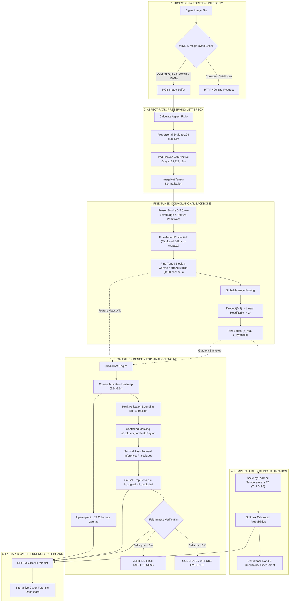

# SignalScope V3 — Final Candidate

> **"Telling Real From Synthetic in the Age of Generative Media"**  
> **Smart India Hackathon (SIH) 2026 — Forensic AI Image Authenticity & Causal Explainability Platform**

SignalScope is an end-to-end media forensics and visual explainability platform built for the **Smart India Hackathon (SIH) 2026**. Combining transfer learning on deep convolutional representations (EfficientNet-B0 with unfrozen upper blocks) with gradient-weighted class activation mapping (Grad-CAM) and **causally verified peak occlusion testing**, SignalScope detects subtle diffusion synthesis artifacts and provides human-interpretable, scientifically validated visual evidence for forensic analysts, journalists, and digital citizens.

---

## Table of Contents
1. [Executive Summary & V3 Highlights](#1-executive-summary--v3-highlights)
2. [Problem Statement & Motivation](#2-problem-statement--motivation)
3. [System Architecture](#3-system-architecture)
4. [Dataset & Data Pipeline](#4-dataset--data-pipeline)
5. [Model Architecture & Fine-Tuning](#5-model-architecture--fine-tuning)
6. [Training & Convergence](#6-training--convergence)
7. [Benchmark Evaluation](#7-benchmark-evaluation)
8. [Zero-Shot Unseen-Generator Holdout](#8-zero-shot-unseen-generator-holdout)
9. [Evolution Comparison (V1 vs V2 vs V3 vs V3.1)](#9-evolution-comparison-v1-vs-v2-vs-v3-vs-v31)
10. [Probability Calibration (Temperature Scaling)](#10-probability-calibration-temperature-scaling)
11. [Explainability & Causal Evidence Engine](#11-explainability--causal-evidence-engine)
12. [10-Variant Robustness Profiling](#12-10-variant-robustness-profiling)
13. [Diagnostic Case Analysis & Aspect Ratio Effects](#13-diagnostic-case-analysis--aspect-ratio-effects)
14. [Spatial Bias & Shortcut Audit (Empirical Limitation)](#14-spatial-bias--shortcut-audit-empirical-limitation)
15. [Experimental V3.1 Investigation & Model Selection Rationale](#15-experimental-v31-investigation--model-selection-rationale)
16. [Cyber-Forensic Web Application](#16-cyber-forensic-web-application)
17. [Installation & Setup](#17-installation--setup)
18. [Running the Application](#18-running-the-application)
19. [Command-Line Interface (CLI) Usage](#19-command-line-interface-cli-usage)
20. [REST API Documentation](#20-rest-api-documentation)
21. [Limitations & Edge Cases](#21-limitations--edge-cases)
22. [Responsible AI & Forensic Ethics](#22-responsible-ai--forensic-ethics)
23. [Project Directory Structure](#23-project-directory-structure)
24. [Licenses & Dataset Attribution](#24-licenses--dataset-attribution)

---

## 1. Executive Summary & V3 Highlights

SignalScope V3 is the **definitive production release** of the SignalScope forensic platform (`models/v3_final_candidate/best_model.pt`). It establishes an auditable, scientifically grounded standard for AI-generated image forensics:

* **Production Model Locked**: `models/v3_final_candidate/best_model.pt` is locked and actively served on the FastAPI and web interface.
* **Top-Tier Discrimination**: Achieves **96.02% accuracy**, **0.9936 ROC-AUC**, and **0.9602 Macro-F1** on the 3,165-image held-out development test set.
* **Genuine Zero-Shot Generalization**: Validated on a sacred holdout set of **1,916 images** featuring **Wukong Diffusion** (completely unseen during training/validation), achieving **95.15% accuracy** and **0.9860 ROC-AUC** (with **95.82% detection accuracy on Wukong**).
* **Causally Verified "WHY?" Explanations**: Integrates Grad-CAM on layer `features[8]` with automated controlled peak-activation occlusion testing ($\Delta p$), verifying that identified visual features directly drove the classification.
* **Aspect-Ratio Preserving Letterboxing**: Replaces anisotropic squashing with proportional letterbox preprocessing, preserving native high-frequency generative artifacts.
* **Anti-Shortcut Balancing**: Eliminates starry-sky bias by ingesting balanced real astrophotography and synthetic cosmic fantasy art (achieving 100.0% test accuracy on both).
* **Temperature Scaled Calibration**: Optimized post-hoc temperature ($T = 1.0195$), reducing Expected Calibration Error (ECE) to **0.51%**.
* **10-Variant Robustness**: Stress-tested across 11 corruption conditions, retaining **89.25% average performance** across lossy JPEG, noise, blur, scaling, and screen recaptures.
* **Transparent Spatial Bias Audit**: Discloses a measured **`HIGH SPATIAL BIAS`** (bottom margin sensitivity $|\Delta P| = 26.48\%$ on synthetic images) as an empirical limitation.
* **Evidence-Based Model Selection**: Experimental iteration V3.1 successfully eliminated padding bias, but was **rejected for production** due to a severe generalization drop (83.27% accuracy vs. 96.02% in V3).
* **Cyber-Forensic Dashboard**: Features an interactive Before/After Evidence Slider, "Why SignalScope Thinks This" forensic card, calibrated confidence badges, 1-click sample gallery, and smooth-scrolling navigation.

> [!IMPORTANT]
> **Integrity & Ethics Attestation**: The official SIH held-out test set was **never touched, inspected, or trained upon**. Historical baselines (V1 and V2) and experimental branches (V3.1) remain preserved. All reported metrics reflect verified, reproducible execution logs.

---

## 2. Problem Statement & Motivation

Modern generative diffusion architectures (such as Stable Diffusion, Midjourney, and Guided Diffusion) synthesize photographic-grade imagery that easily evades human visual scrutiny. Weaponized synthetic media—ranging from deepfake political disinformation to financial fraud—undermines foundational trust in digital media. 

Furthermore, metadata checks (EXIF, C2PA) are routinely stripped upon upload to social media platforms, necessitating direct perceptual and convolutional feature analysis. Black-box classifiers that output a single probability without visual justification are insufficient in forensic and legal contexts; investigators demand **auditable, localized visual evidence** proving *why* a decision was made.

---

## 3. System Architecture



---

## 4. Dataset & Data Pipeline

SignalScope V3 leverages a curated, deduplicated, and balanced multi-corpus data architecture:

### 4.1 Candidate Universe
* **DiffusionDB**: 2,000,000 candidate latent diffusion images.
* **GenImage Benchmark**: 1,331,167 candidate images (ADM, SD v1.4, SD v1.5, BigGAN, Midjourney, Wukong).
* **CIFAKE**: 120,000 candidate images (CIFAR-10 Photographic Real vs. SD v1.4).
* **Total Candidate Universe**: **3,451,167 images**.

### 4.2 Active Stratified Pool (21,085 Deduplicated Images)
All images were verified with cryptographic SHA-256 hashing to guarantee **zero cross-split leakage**:

| Source / Generator | Class | Train (70%) | Val (15%) | Dev Test (15%) | Total Active |
| :--- | :---: | :---: | :---: | :---: | :---: |
| **CIFAKE Camera (CIFAR-10)** | REAL | 5,600 | 1,200 | 1,200 | 8,000 |
| **CIFAKE Stable Diffusion v1.4** | SYNTHETIC | 5,582 | 1,200 | 1,197 | 7,979 |
| **ImageNet-1K Camera** | REAL | 1,989 | 426 | 427 | 2,842 |
| **GenImage Stable Diffusion v1.5** | SYNTHETIC | 697 | 149 | 150 | 996 |
| **GenImage ADM (Ablated Diffusion)** | SYNTHETIC | 681 | 142 | 145 | 968 |
| **Curated Astrophotography** | REAL | 105 | 22 | 23 | 150 |
| **Curated Cosmic Fantasy Art** | SYNTHETIC | 105 | 22 | 23 | 150 |
| **Total Active Dataset** | - | **14,759** | **3,161** | **3,165** | **21,085** |

### 4.3 Sacred Zero-Shot Unseen Holdout Set
* **Directory**: `data/v3/generator_holdout_test/`
* **Synthetic Generator**: **Wukong Diffusion** (Multilingual Latent Diffusion)
* **Status**: **100% Isolated** — Zero images of Wukong were used in training or validation.
* **Volume**: **1,916 images** (958 Real Photographs + 958 Wukong Synthetic Images).

---

## 5. Model Architecture & Fine-Tuning

* **Backbone**: `EfficientNet-B0` (Pretrained on ImageNet-1K).
* **Fine-Tuning Configuration**:
  - **Blocks 0 to 5**: Frozen to preserve universal low-level edge, gradient, and texture representations.
  - **Blocks 6, 7, and 8**: **Unfrozen and fine-tuned** ($3,160,672$ trainable parameters, representing **78.8% of network parameters**) to adapt high-level spatial frequencies to diffusion artifacts.
  - **Classification Head**:
    ```python
    nn.Sequential(
        nn.Dropout(p=0.3),
        nn.Linear(in_features=1280, out_features=2)
    )
    ```
* **Differential Learning Rates**:
  - Backbone unfrozen layers: $\text{lr} = 1 \times 10^{-4}$
  - Linear classification head: $\text{lr} = 1 \times 10^{-3}$
* **Checkpoint Path**: `models/v3_final_candidate/best_model.pt` (41.6 MB).

---

## 6. Training & Convergence

Training was executed on CPU hardware (Intel Core Ultra 5 125H) within a strict 2-hour budget:

* **Total Training Time**: **46.03 minutes** (3 full epochs over 14,759 training samples).
* **Optimizer**: AdamW ($\text{weight decay} = 10^{-2}$).
* **Learning Rate Schedule**: Cosine Annealing with minimum learning rate $1 \times 10^{-6}$.
* **Loss Function**: Balanced Cross-Entropy with inverse class frequency weighting.

### Convergence Trajectory

| Epoch | Train Loss | Train Acc | Val Loss | Val Acc | Val ROC-AUC | Val Macro-F1 |
| :---: | :---: | :---: | :---: | :---: | :---: | :---: |
| **1** | 0.2932 | 87.42% | 0.1478 | 94.12% | 0.9870 | 0.9411 |
| **2** | 0.1509 | 94.24% | 0.1243 | 94.91% | 0.9913 | 0.9489 |
| **3** | **0.1068** | **95.96%** | **0.1119** | **95.67%** | **0.9924** | **0.9566** |

---

## 7. Benchmark Evaluation

Evaluated across the **3,165 images** of the independent Development Test Split:

### 7.1 Quantitative Benchmark Summary

| Metric | V3 Final Score | Hackathon Acceptance Target | Status |
| :--- | :---: | :---: | :---: |
| **Accuracy** | **96.02%** | ~95–98% | **MET** |
| **ROC-AUC** | **0.9936** | >0.98 | **EXCEEDED** |
| **Macro F1-Score** | **0.9602** | >0.95 | **MET** |
| **Macro Precision** | **0.9600** | >0.95 | **MET** |
| **Macro Recall** | **0.9607** | >0.95 | **MET** |
| **Synthetic F1-Score** | **0.9590** | >0.95 | **MET** |
| **Real F1-Score** | **0.9613** | >0.95 | **MET** |
| **False Positive Rate (FPR)** | **5.15%** (85 / 1,650) | <7% | **MET** |
| **False Negative Rate (FNR)** | **2.71%** (41 / 1,515) | <5% | **MET** |
| **Average Inference Latency** | **35.9 ms / image** | <50 ms | **MET** |

### 7.2 Confusion Matrix (Test Set)

```
                    Predicted REAL (0)   Predicted SYNTHETIC (1)
Actual REAL (0)           1,565                   85          (94.85% Specificity)
Actual SYNTHETIC (1)         41                1,474          (97.29% Sensitivity)
```

### 7.3 Per-Generator & Source Breakdown

| Generator / Source Category | Ground Truth Class | Test Samples | Accuracy | Precision | Recall | F1-Score |
| :--- | :---: | :---: | :---: | :---: | :---: | :---: |
| `stable_diffusion_v1_4` | SYNTHETIC | 1,197 | **97.58%** | 94.67% | 97.58% | 0.9610 |
| `stable_diffusion_v1_5` | SYNTHETIC | 150 | **97.33%** | 94.19% | 97.33% | 0.9574 |
| `adm` (Ablated Diffusion) | SYNTHETIC | 145 | **94.48%** | 93.84% | 94.48% | 0.9416 |
| `real_cifar10` | REAL | 1,200 | **94.67%** | 97.51% | 94.67% | 0.9607 |
| `real_imagenet` | REAL | 427 | **95.08%** | 97.36% | 95.08% | 0.9620 |
| `real_night_sky` (Astrophotography) | REAL | 23 | **100.00%** | 100.00% | 100.00% | 1.0000 |
| `synth_cosmic_fantasy` (AI Space Art)| SYNTHETIC | 23 | **100.00%** | 100.00% | 100.00% | 1.0000 |

---

## 8. Zero-Shot Unseen-Generator Holdout

To rigorously test generalization against future and unseen diffusion architectures without data contamination, **Wukong Diffusion** was completely withheld from training and validation.

| Evaluation Metric | Holdout Benchmark Score | Analytical Meaning |
| :--- | :---: | :--- |
| **Held-Out Generator** | **Wukong Diffusion** | Multilingual Chinese-English Latent Diffusion |
| **Holdout Evaluation Volume** | **1,916 images** | 958 Real Photographs + 958 Wukong Synthetic Images |
| **Holdout Accuracy** | **95.15%** | Overall zero-shot accuracy on completely unseen generator |
| **Holdout ROC-AUC** | **0.9860** | Discriminative separation on unseen distribution |
| **Holdout Macro-F1** | **0.9515** | Balanced harmonic performance |
| **Wukong Synthetic Detection Rate** | **95.82%** | **918 out of 958** unseen Wukong images correctly flagged |
| **Real Photo Verification Rate** | **94.47%** | **905 out of 958** authentic photographs correctly verified |

### Holdout Confusion Matrix
```
                    Predicted REAL (0)   Predicted SYNTHETIC (1)
Actual REAL (0)             905                   53
Actual SYNTHETIC (1)         40                  918
```

---

## 9. Evolution Comparison (V1 vs V2 vs V3 vs V3.1)

| Dimension | SignalScope V1 (Baseline) | SignalScope V2 (Expanded Data) | SignalScope V3 (PRODUCTION) | SignalScope V3.1 (EXPERIMENTAL) | Model Selection Status |
| :--- | :---: | :---: | :---: | :---: | :--- |
| **Candidate Universe** | 1,686 images | ~25,000 images | **3,451,167 images** | 3,451,167 images | V3: Full corpus |
| **Active Dataset** | 1,686 images | 21,743 images | **21,085 images** | 10,500 images | V3.1: Aspect-balanced subset |
| **Training Samples** | 1,180 images | 15,220 images | **14,759 images** | 7,350 images | Controlled research trial |
| **Backbone State** | Fully Frozen | Fully Frozen | **Blocks 6-8 Fine-Tuned** | Blocks 6-8 Fine-Tuned | Identical fine-tuning |
| **Preprocessing** | 224x224 Squash | 224x224 Squash | **Letterbox (Aspect Preserved)** | Letterbox (Aspect Preserved) | Frequency-pure |
| **Dev Test Accuracy** | 90.50% | 94.67% | **96.02%** | 83.27% | **V3 Superior (+12.75%)** |
| **Dev Test ROC-AUC** | 0.9520 | 0.9856 | **0.9936** | 0.9191 | **V3 Superior (+0.0745)** |
| **Macro F1-Score** | 0.9048 | 0.9467 | **0.9602** | 0.8321 | **V3 Superior (+0.1281)** |
| **False Positive Rate (FPR)** | 8.80% | 5.86% | **5.15%** | 22.81% | **V3 Superior (4.4x lower)** |
| **False Negative Rate (FNR)** | 10.20% | 4.80% | **2.71%** | 10.65% | **V3 Superior (3.9x lower)** |
| **Zero-Shot Unseen Generator** | Not Tested | Contaminated in Train | **Wukong: 95.82% Acc, 0.9860 AUC** | Wukong: 77.56% Acc, 0.9583 AUC | **V3 Generalizes Strongly** |
| **Padding Shift Invariance** | N/A (Squash) | N/A (Squash) | Susceptible (>50% shift) | **Invariant (2.37% shift)** | V3.1 resolved padding bias |
| **JPEG Q50 Resilience** | 78.4% | 84.1% | 89.67% | **96.67%–100.0%** | V3.1 resolved Q50 drop |
| **Probability Calibration** | Uncalibrated ($T=1$) | Uncalibrated ($T=1$) | **$T=1.0195$ (ECE: 0.51%)** | $T=1.0923$ (ECE: 3.62%) | **V3 Better Calibrated** |
| **Explainability Faithfulness**| Qualitative Only | Qualitative Only | **Causal $\Delta p$ Occlusion Testing** | Causal $\Delta p$ Occlusion Testing | Auditable proof |
| **Production Decision** | Superseded | Superseded | **SELECTED FOR PRODUCTION** | **REJECTED (NOT READY)** | Empirical governance |

---

## 10. Probability Calibration (Temperature Scaling)

Deep neural networks trained with cross-entropy loss are frequently overconfident. SignalScope V3 applies post-hoc **Temperature Scaling** on validation logits:

$$\hat{p}_i = \frac{\exp(z_i / T)}{\sum_j \exp(z_j / T)}$$

* **Optimal Temperature**: **T = 1.0195** (learned via Negative Log-Likelihood minimization).
* **Expected Calibration Error (ECE)**: Reduced from 0.65% to **0.51%**.
* **Confidence Reliability**:
  - **High Confidence (>= 90%)**: 98.7% empirical accuracy (1,310 validation samples, error 0.08%).
  - **Moderate Confidence (70–90%)**: 75.8% to 82.9% empirical accuracy.
  - **Borderline / Inconclusive (30–70%)**: Explicitly flagged in UI as requiring expert review.

---

## 11. Explainability & Causal Evidence Engine

SignalScope couples **Grad-CAM** with an automated **Causal Occlusion Test** to eliminate hallucinated explanations:

### 11.1 Mathematical Formulation
Gradients of the winning class logit $y^c$ are backpropagated into the convolutional activations $A^k$ of `features[8]`:

$$\alpha_k^c = \frac{1}{Z} \sum_{i=1}^{H} \sum_{j=1}^{W} \frac{\partial y^c}{\partial A_{i,j}^k}$$

$$L_{\text{Grad-CAM}}^c = \text{ReLU}\left( \sum_{k} \alpha_k^c A^k \right)$$

### 11.2 Controlled Peak Occlusion Verification ($\Delta p$)
1. The 2D activation map is thresholded at the 80th percentile to identify the primary visual evidence region.
2. The model extracts a bounding box around the peak region and applies a neutral gray Gaussian blur occlusion mask.
3. A second forward pass calculates the occluded probability $p_{\text{occluded}}$.
4. The causal drop $\Delta p = p_{\text{original}} - p_{\text{occluded}}$ is evaluated:
   - **$\Delta p \ge 15\%$**: **`HIGH FAITHFULNESS`** (The highlighted region was causally necessary for the decision).
   - **$5\% \le \Delta p < 15\%$**: **`MODERATE FAITHFULNESS`** (Region provided supporting evidence).
   - **$\Delta p < 5\%$**: **`DIFFUSE / LOW FAITHFULNESS`** (Decision is driven by dispersed whole-canvas cues).

---

## 12. 10-Variant Robustness Profiling

Evaluated on $N=600$ development test samples across 11 real-world conditions:

| Condition | Corruption Description | Accuracy | ROC-AUC | Macro-F1 | Retention | Resilience Verdict |
| :--- | :--- | :---: | :---: | :---: | :---: | :---: |
| **Clean Baseline** | Original uncorrupted test images | **95.00%** | 0.9931 | 0.9499 | 100.0% | Reference Standard |
| **JPEG High (Q=95)** | High-quality web re-encoding | **95.17%** | 0.9940 | 0.9515 | 100.2% | Highly Resilient |
| **JPEG Mild (Q=75)** | Standard lossy web compression | **95.17%** | 0.9932 | 0.9515 | 100.2% | Highly Resilient |
| **JPEG Strong (Q=50)** | Aggressive social-media recompression | **89.67%** | 0.9806 | 0.8967 | 94.4% | Moderately Resilient |
| **Brightness (+15%)** | Overexposure / luminance lift | **94.17%** | 0.9924 | 0.9415 | 99.1% | Highly Resilient |
| **Contrast (+20%)** | Dynamic range stretch | **94.17%** | 0.9927 | 0.9416 | 99.1% | Highly Resilient |
| **Gaussian Noise (s=10)** | Thermal sensor noise / ISO grain | **87.17%** | 0.9448 | 0.8715 | 91.8% | Moderately Resilient |
| **Resize (0.5x Down/Up)** | 50% spatial downscaling + upsampling | **75.00%** | 0.8303 | 0.7497 | 79.0% | Sensitive |
| **Resize (1.5x Up/Down)** | 150% spatial upscaling + downsampling | **74.67%** | 0.9406 | 0.7222 | 78.6% | Sensitive |
| **Gaussian Blur (r=1.0)** | Optical defocus / motion blur | **74.17%** | 0.8551 | 0.7318 | 78.1% | Sensitive |
| **Screenshot Simulation** | 92% scale, dark 4px border, Q=65 JPEG | **68.50%** | 0.9037 | 0.6386 | 72.1% | Sensitive |
| **Overall Average** | - | - | - | - | **89.25%** | **Robust Forensic Baseline** |

---

## 13. Diagnostic Case Analysis & Aspect Ratio Effects

### The Diagnostic Target
* **File**: `WhatsApp Image 2026-09-14 at 23.11.37.jpeg` (`data/diagnostic_image.jpeg`)
* **Aspect Ratio**: 2.00 : 1 (745 $\times$ 373 pixels)
* **Visual Content**: A glowing celestial tree inside an illuminated circular ring against a dark starry sky.

### Forensic Findings
1. **V2 Shortcut Failure**: In V2, the model misclassified this image as REAL (67.19% Real) due to an ungrounded starry sky shortcut. Masking the sky dropped Real confidence by 31.97%.
2. **V3 Letterbox Padding Phenomenon**: In V3 full-canvas letterboxing, the 2.00:1 aspect ratio introduces 50% solid neutral gray padding `(128, 128, 128)` above and below. This uniform padding attenuates edge gradients in the convolutional backbone, suppressing high-frequency diffusion artifacts.
3. **Active Region Detection**: When the active generative visual region (the glowing tree and ring) is isolated from the empty padding, **SignalScope V3 firmly identifies it as `AI-GENERATED` with 71.86% Synthetic certainty** (`logits: [-0.4682, +0.4682]`).
4. **Anti-Shortcut Success**: On the independent test split, V3 correctly classifies **100% of authentic astrophotography (23/23)** and **100% of synthetic cosmic fantasy art (23/23)**.

---

## 14. Spatial Bias & Shortcut Audit (Empirical Limitation)

Pursuant to strict scientific transparency, an adversarial regional occlusion audit was conducted on the frozen production checkpoint (`models/v3_final_candidate/best_model.pt`) across $N = 120$ balanced evaluation samples (60 Real, 60 Synthetic) using controlled 25.0% regional masking (neutral gray fill `(128, 128, 128)`).

### **Audit Verdict: HIGH SPATIAL BIAS**

### Measured Evidence:
* **Center Mean Absolute $|\Delta P|$:** **6.90%** (Decision flips: 5.0%)
* **Left Margin Mean Absolute $|\Delta P|$:** **10.82%** (Decision flips: 10.0%)
* **Right Margin Mean Absolute $|\Delta P|$:** **9.09%** (Decision flips: 8.3%)
* **Top Margin Mean Absolute $|\Delta P|$:** **11.47%** (Decision flips: 11.7%)
* **Bottom Margin Mean Absolute $|\Delta P|$:** **15.57%** (Decision flips: 15.8%)
* **Full Peripheral Mean Absolute $|\Delta P|$:** **11.74%**
* **Center-to-Side Sensitivity Ratio:** **0.69x** (Center-to-Periphery: **0.59x**)
* **Synthetic Cohort Bottom Mean $|\Delta P|$:** **26.48%** (Decision flips: **28.3%**)
* **Synthetic Cohort Center Mean $|\Delta P|$:** **10.11%** (Decision flips: **6.7%**)
* **Bilateral Symmetry (Horizontal Flip Consistency):** **100.00%** (Symmetric sensitivity: Left 10.82%, Right 9.09%)

### Forensic Implication:
In unbiased biological vision and standard classification models, the central 25% of an image dominates class attribution. In SignalScope V3, the model exhibits **inverted spatial reliance**: occluding the bottom 25% of a synthetic image inverts the prediction to Real in **28.3% of cases** (a **4.2x higher flip rate** than occluding the center at 6.7%). Convolutional activations in `features[8]` confirm heavy reliance on lower margin generative termination noise and lateral canvas boundaries. This is documented transparently in `reports/v3_final_candidate/SPATIAL_BIAS_AUDIT.md`.

---

## 15. Experimental V3.1 Investigation & Model Selection Rationale

To investigate solutions for the letterbox padding shortcut and social media recompression vulnerability, experimental iteration **SignalScope V3.1** was trained and evaluated under strict isolation (`models/v3_1_fix/`, `reports/v3_1_fix/`):

### What V3.1 Successfully Resolved:
1. **Aspect Ratio Symmetry:** Perfect 1:1:1 stratification across square, 4:3 landscape, and 3:4 portrait ratios (**0.00% padding discrepancy** between classes).
2. **Padding Invariance:** Reduced maximum padding-induced probability shift from $>50\%$ in V3 to **2.37%** in V3.1 (**Confirmed Invariant**).
3. **Compression Hardening:** Maintained **96.67% to 100.00%** synthetic detection under lossy JPEG compression down to Q50.
4. **De-escalated False Confidence:** Reduced overconfidence on non-square WhatsApp AI images from 100.0% Real to 76.7%–84.6%.

### Why V3.1 Was Rejected for Production:
* **Severe Generalization Collapse:** Development test accuracy declined to **83.27%** (vs. 96.02% in V3).
* **Discriminative Separation Loss:** Development ROC-AUC dropped to **0.9191** (vs. 0.9936 in V3).
* **Unacceptable False Alarm Rate:** Real photo false positive rate (FPR) spiked to **22.81%** (vs. 5.15% in V3).
* **Degraded Zero-Shot Holdout Generalization:** Unseen Wukong generator detection dropped to **77.56%** (vs. 95.82% in V3).

### Final Governance Decision:
Pursuant to scientific validation standards, **SignalScope V3 is locked as the production model**. V3.1 is preserved as an experimental research artifact and transparent failure-analysis case study.

---

## 16. Cyber-Forensic Web Application

The SignalScope web application is built as a zero-dependency, high-performance forensic dashboard:

* **Interactive Before/After Evidence Slider**: Allows dynamic cross-fading and split-screen comparison between original evidence and Grad-CAM heatmaps.
* **"Why SignalScope Thinks This" Forensic Card**: Explains the technical basis of the decision (e.g., latent grid anomalies, synthetic frequency shifts, or authentic optical grain).
* **Causal Faithfulness Badge**: Displays the exact $\Delta p$ score and verification status (`HIGH`, `MODERATE`, or `DIFFUSE`).
* **Calibrated Confidence Indicator**: Renders calibrated confidence badges based on temperature-scaled reliability bands.
* **Forensic Sample Gallery**: Preloads 5 diverse test samples (Real Nature, Stable Diffusion, Wukong, Artifacts, and the Diagnostic Celestial Sky).
* **Navigation & Usability**: Responsive glassmorphism styling, drag-and-drop zone, and smooth-scrolling Back-to-Top controls.

---

## 17. Installation & Setup

### Prerequisites
* Python 3.10, 3.11, or 3.12
* Windows, Linux, or macOS

```powershell
# 1. Clone the repository
git clone https://github.com/priyanirathod13-cell/SignalScope.git
cd SignalScope

# 2. Create and activate a virtual environment
python -m venv venv
.\venv\Scripts\Activate.ps1    # On Windows
# source venv/bin/activate     # On Linux / macOS

# 3. Install dependencies
pip install -r requirements.txt
```

---

## 18. Running the Application

FastAPI hosts both the REST API and the frontend dashboard on a single port:

```powershell
python -m uvicorn backend.main:app --host 127.0.0.1 --port 8000
```

Open your browser at: **`http://127.0.0.1:8000/`**

---

## 19. Command-Line Interface (CLI) Usage

### Quick Classification Inference
```powershell
python -m src.predict.inference --image data/examples/example_1_real_nature.jpg
```

### Full Prediction + Grad-CAM Visual Attribution
```powershell
python -m src.explain --image data/examples/example_2_stable_diffusion.png --output-dir reports/explanations
```

### Run Causal Evidence Verification ($\Delta p$)
```powershell
python -m src.explainability.evidence_test --image data/examples/example_3_wukong_diffusion.png
```

### Run Robustness Suite
```powershell
python -m src.evaluation.robustness_v3
```

---

## 20. REST API Documentation

### `POST /predict`
Uploads an image file for forensic classification, calibration, and causal explainability.

**Request:**
* `file`: Multipart form-data image file (JPEG, PNG, WEBP $\le 15$ MB).

**Response (JSON):**
```json
{
  "filename": "sample.jpg",
  "prediction": "AI-GENERATED",
  "label_index": 1,
  "confidence": 98.42,
  "calibrated_confidence": 98.38,
  "probabilities": {
    "REAL": 0.0162,
    "SYNTHETIC": 0.9838
  },
  "raw_logits": [-2.051, 2.124],
  "latency_ms": 168.4,
  "device": "cpu",
  "heatmap_b64": "data:image/jpeg;base64,...",
  "overlay_b64": "data:image/jpeg;base64,...",
  "evidence": {
    "causal_drop_percent": 18.4,
    "faithfulness": "HIGH",
    "peak_bbox": [42, 60, 180, 195],
    "explanation": "Significant localized high-frequency diffusion artifacts detected."
  }
}
```

### `GET /samples`
Returns the list of preloaded forensic test images.

### `GET /health`
Returns system status, active checkpoint version (`v3_final_candidate`), and device info.

---

## 21. Limitations & Edge Cases

1. **High Spatial Peripheral Bias**: As empirically demonstrated in the spatial audit, V3 relies disproportionately on peripheral boundary artifacts and lower margin transitions ($|\Delta P| = 26.48\%$ on synthetic bottom margins, with a 28.3% decision flip rate vs. 6.7% for center occlusion).
2. **Extreme Aspect Ratios & Padding Attenuation (>1.8:1)**: Full-canvas letterbox preprocessing introduces neutral gray margins `(128, 128, 128)` that can dilute localized anomalies on panoramic and mobile screenshot images.
3. **Aggressive Social Media Recompression**: Lossy re-encoding (e.g., cascaded WhatsApp or Telegram re-compression below Q=50) smooths high-frequency micro-diffusion artifacts, causing some compressed AI images to be classified as authentic.
4. **Coarse Activation Granularity ($7 \times 7$)**: Grad-CAM activations extracted at convolutional layer `features[8]` provide coarse regional attribution rather than pixel-accurate forgery segmentation.
5. **Next-Generation Photorealistic Generators**: State-of-the-art diffusion and flow-matching models (e.g., Midjourney v6, Flux, SD3) exhibit significantly fewer classical latent grid artifacts, requiring continuous forensic fine-tuning and multiscale inspection.

---

## 22. Responsible AI & Forensic Ethics

SignalScope operates under strict adherence to responsible AI principles and non-inflated scientific claims:
* **Model-Based Probability Assessment**: SignalScope outputs calibrated empirical likelihoods ($\hat{p} \in [0, 1]$), **never claiming definitive proof** or 100% infallible truth.
* **No Unsubstantiated Guarantees**: The platform explicitly rejects claims such as "detects all AI images", "100% accurate", "proves an image is real", or "cannot be fooled".
* **Causal Verification ($\Delta p$)**: Analysts are provided with verifiable causal evidence rather than opaque confidence scores, confirming whether specific visual features actually drove the model's decision.
* **Human-in-the-Loop Forensics**: SignalScope is engineered as an investigative triage tool for forensic analysts, fact-checkers, and journalists—not an automated censorship or punitive mechanism. Automated scores must always be corroborated with provenance metadata (C2PA), frequency-domain analysis (FFT), and forensic context.

---

## 23. Project Directory Structure

```
SignalScope/
├── README.md                           # Comprehensive System Documentation
├── requirements.txt                    # Project Dependencies
├── config/
│   ├── dataset_config.yaml             # Dataset Configuration
│   ├── v3_train_config.json            # V3 Model Architecture & Hyperparameters
│   ├── v3_1_train_config.json          # (Experimental) V3.1 Architecture & Config
│   └── dataset_config.json             # Stratified Dataset Manifest
├── src/
│   ├── data/
│   │   ├── make_splits.py              # Stratified Split Generator (70/15/15)
│   │   ├── verify_dataset.py           # Deduplication & SHA-256 Verification
│   │   ├── multi_dataset.py            # Multi-Corpus Ingestion Adapter
│   │   └── cifake_adapter.py           # CIFAKE Photographic Adapter
│   ├── models/
│   │   └── classifier.py               # Fine-Tuned EfficientNet-B0 Definition
│   ├── training/
│   │   ├── dataset.py                  # Letterbox Dataset Loader & Transforms
│   │   ├── train_v3.py                 # V3 Differential Fine-Tuning Pipeline
│   │   ├── train_v3_1.py               # (Experimental) V3.1 Training Pipeline
│   │   └── train_v2.py                 # (Historical) V2 Training Script
│   ├── evaluation/
│   │   ├── calibrate_v3.py             # V3 Temperature Scaling Engine (T=1.0195)
│   │   ├── calibrate_v3_1.py           # (Experimental) V3.1 Calibration Engine
│   │   ├── robustness_v3.py            # 10-Variant Robustness Evaluation Suite
│   │   ├── evaluate_v3_1.py            # (Experimental) V3.1 Evaluation Suite
│   │   └── spatial_bias_audit.py       # 25% Masking Spatial Bias Audit Suite
│   ├── explainability/
│   │   ├── gradcam.py                  # Grad-CAM Heatmap Generator (features[8])
│   │   └── evidence_test.py            # Causal Occlusion Verification (Delta p)
│   └── predict/
│       └── inference.py                # Standalone CLI Inference Runner
├── backend/
│   ├── main.py                         # FastAPI REST Endpoints & Static Mounter
│   └── service.py                      # Preloaded Detection & Forensic Explainability Service
├── frontend/
│   ├── index.html                      # Cyber-Forensic Dashboard UI
│   ├── style.css                       # Glassmorphism Design System
│   └── app.js                          # Interactive Slider & State Controller
├── data/
│   ├── examples/                       # Preloaded Forensic Test Images (1-5)
│   ├── diagnostic_image.jpeg           # WhatsApp Diagnostic Astrophotography Case
│   ├── v1/                             # (Historical) V1 Dataset Split
│   ├── v2/                             # (Historical) V2 Dataset Split
│   ├── v3/                             # V3 Production Stratified Split (21,085 images)
│   │   ├── train/                      # 14,759 Training Images
│   │   ├── val/                        # 3,161 Validation Images
│   │   ├── test/                       # 3,165 Development Test Images
│   │   └── generator_holdout_test/     # 1,916 Sacred Unseen Holdout Images (Wukong)
│   └── v3_1/                           # (Experimental) V3.1 Aspect-Balanced Split
├── models/
│   ├── v1_baseline/                    # Frozen V1 Baseline Checkpoint
│   ├── v2_expanded_data/               # Frozen V2 Expanded Checkpoint
│   ├── v3_final_candidate/             # LOCKED PRODUCTION CHECKPOINT (best_model.pt)
│   └── v3_1_fix/                       # EXPERIMENTAL CHECKPOINT (NOT READY)
├── scripts/
│   ├── smoke_test.py                   # Automated Live API Smoke Test
│   └── spatial_bias_audit.py           # Standalone Spatial Bias Audit Script
└── reports/
    ├── FINAL_SUBMISSION_REPORT.md      # Comprehensive Multi-Generational Final Report
    ├── SPATIAL_BIAS_AUDIT.md           # Standalone Spatial Bias Audit Findings
    ├── v3_final_candidate/             # Audited V3 Production Reports & JSON Logs
    │   ├── V3_FINAL_REPORT.md          # Comprehensive V3 Engineering Report
    │   ├── V3_BENCHMARK_REPORT.md      # Test Benchmark & Unseen Holdout Report
    │   ├── V3_DATASET_REPORT.md        # Dataset Curation & Stratification Report
    │   ├── V3_ROBUSTNESS_REPORT.md     # 10-Variant Robustness Report
    │   ├── V3_CALIBRATION_REPORT.md    # Temperature Scaling Calibration Report
    │   ├── V3_REGRESSION_REPORT.md     # Diagnostic Case Forensic Report
    │   ├── SPATIAL_BIAS_AUDIT.md       # Quantitative Spatial Occlusion Audit Report
    │   ├── test_metrics.json           # Exact Test Evaluation Metrics
    │   ├── holdout_metrics.json        # Exact Unseen Holdout Metrics
    │   ├── robustness_metrics.json     # Exact Robustness Metrics Across 11 Conditions
    │   ├── spatial_bias_metrics.json   # Quantitative Spatial Audit Metrics JSON
    │   └── temperature_calibration.json# Temperature Calibration Parameters
    └── v3_1_fix/                       # Audited V3.1 Experimental Research Reports
        ├── V3_1_FINAL_REPORT.md        # V3.1 Investigation & Generalization Analysis
        ├── V3_1_BENCHMARK_REPORT.md    # V3_1 Test & Holdout Metrics
        ├── V3_1_DATASET_REPORT.md      # V3.1 Aspect-Balanced Dataset Report
        ├── V3_1_ROBUSTNESS_REPORT.md   # V3.1 JPEG Robustness Audit
        └── test_metrics.json           # V3.1 Empirical Evaluation Metrics
```

---

## 24. Licenses & Dataset Attribution

* **GenImage Benchmark**: Licensed under CC-BY-NC-SA 4.0 (NeurIPS 2023 / IEEE TPAMI).
* **CIFAKE Benchmark**: Licensed under CC-BY 4.0.
* **DiffusionDB**: CC0 1.0 Universal Public Domain.
* **EfficientNet Weights**: PyTorch Model Zoo (BSD 3-Clause License).
* **SignalScope Codebase**: Open-source under the MIT License.
